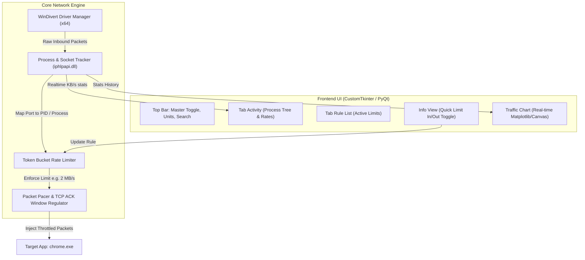

# MiniNetLimiter — Project Planning & Architecture Specification

> **Tujuan Proyek**: Membangun aplikasi pembatas kecepatan internet (*bandwidth limiter / traffic shaper*) per-aplikasi di Windows yang gratis, ringan, dan memiliki desain serta antarmuka yang mengacu langsung ke **NetLimiter** (berdasarkan referensi screenshot di folder `ui-refrensi/`).

---

## 1. Analisis Referensi UI NetLimiter (`ui-refrensi/`)

Berdasarkan 4 screenshot yang disediakan:

1. **Screenshot 1 (`091326.png`) — Tampilan Utama (Activity & Info View)**:
   - **Top Bar**: Menu bar, master switch (`[x] Blocker On`, `[x] Limiter On`, `[x] Priorities On`), unit selector (`autoByte`), dan kotak pencarian (*Search*).
   - **Left Panel (Activity Tab)**: Pohon proses (*process tree*) menampilkan aplikasi aktif (`agy.exe`, `DepotDownloaderMod`, `Microsoft Edge`, dll.) dengan metrik real-time: `DL Rate`, `UL Rate`, dan ikon `Rule Status`.
   - **Right Panel (Top)**: *Info View* menampilkan detail aturan (*Rule Properties*), tipe limit, arah (*In/Out*), status (*Active*).
   - **Right Panel (Bottom)**: *Traffic chart* menampilkan grafik visual real-time Download (hijau) & Upload (merah/oranye).

2. **Screenshot 2 (`091342.png`) — Interaksi & Penerapan Limit (DepotDownloaderMod)**:
   - Saat aplikasi diklik, panel kanan *Info View* menampilkan form **Rules**:
     - **Limit**: Checkbox `[x] 2 MB/s` pada kolom **In** (Download), dan `[ ] Not set` pada kolom **Out** (Upload).
   - Pada baris proses muncul badge ikon panah biru ke bawah `[↓]` yang menandakan download limit sedang aktif.
   - Grafik di pojok kanan bawah langsung meratakan puncak trafik (*flat line*) tepat di angka `2 MB/s`.

3. **Screenshot 3 (`091400.png`) — Rule List**:
   - Tab khusus menampilkan semua aturan aktif dalam format tabel:
     - `Type` (Limit), `Dir` (In/Out), `For` (Nama Aplikasi), `Value` (`2 MB/s`), `State` (`Active`).
   - Tombol aksi di bawah: `Add rule`, `Edit rule`, `Delete rule`.

4. **Screenshot 4 (`091445.png`) — Network List**:
   - Menampilkan adapter jaringan fisik/virtual yang aktif (Wi-Fi, Ethernet, SSID, Gateway IP).

---

## 2. Rencana Desain Antarmuka MiniNetLimiter

Desain MiniNetLimiter akan meniru layout NetLimiter dengan palet warna Dark Mode yang khas:

```
+----------------------------------------------------------------------------------------------------------+
| MiniNetLimiter   Units: [autoByte v]   [x] Limiter On   [x] Blocker On                 [Search App...]   |
+-----------------------------------------------------------------------------------+----------------------+
| [ Activity ]  [ Rule List ]  [ Network ]                                          | Info View            |
| Filter: (•) All   ( ) Online   ( ) Limited                                        | -------------------- |
+------------------------------------------------------+----------------------------+ Target: chrome.exe   |
| Application Name           | DL Rate    | UL Rate    | Status                     |                      |
+----------------------------+------------+------------+----------------------------+ [ Rules ]            |
| > Internet                 | 2.01 MB/s  | 14.2 KB/s  |                            | Type    In     Out   |
|   v chrome.exe             | 1.98 MB/s  | 12.1 KB/s  | [↓ Limit: 2 MB/s]          | Blocker ( )    ( )   |
|     - PID 14210 (Tab 1)    | 1.95 MB/s  | 11.8 KB/s  |                            | Limit   [x]2M  [ ]--  |
|     - PID 14880 (Broker)   | 30 KB/s    | 0.3 KB/s   |                            |                      |
|   > spotify.exe            | 0 B/s      | 0 B/s      |                            | [Edit Limit]         |
|   > steam.exe              | 45 B/s     | 12 B/s     |                            | [Kill Connection]    |
|   > discord.exe            | 2.1 KB/s   | 1.4 KB/s   |                            +----------------------+
|                            |            |            |                            | Traffic Chart (Live) |
|                            |            |            |                            | 2MB _/\__________ DL |
|                            |            |            |                            | 0KB ------------- UL |
+------------------------------------------------------+----------------------------+----------------------+
| Status: WinDivert Running (Driver Active) | Total DL: 2.01 MB/s | Total UL: 14.2 KB/s                     |
+----------------------------------------------------------------------------------------------------------+
```

### Palet Warna (NetLimiter Dark Style):
- **Background Utama**: `#181818` / `#1e1e1e`
- **Panel / Card Background**: `#252526`
- **Aksen Aktif (Tab Indicator)**: `#99e206` (Neon Lime Green)
- **Grafik Download**: `#4ec9b0` / Hijau (`#2ecc71`)
- **Grafik Upload**: `#e67e22` / Merah Oranye (`#e74c3c`)
- **Teks Utama**: `#ffffff` | **Teks Sekunder/Muted**: `#888888`
- **Highlight Pilihan (Row Select)**: `#094771` (VS Code / NetLimiter Blue)

---

## 3. Arsitektur Teknis Sistem



### 1. WinDivert Engine
- Menangkap paket `inbound` (download) dan `outbound` (upload).
- Menjalankan filter: `inbound and tcp`.

### 2. Fast Process-to-Port Tracker (`ctypes` + `iphlpapi.dll`)
- Memanggil `GetExtendedTcpTable` di Windows API langsung dari memori untuk mendapatkan pasangan `(LocalPort, RemotePort) -> PID`.
- Menggunakan cache thread 100ms agar penggunaan CPU tetap **< 1%**.

### 3. Rate Limiter (Token Bucket & ACK Modulation)
- Menerapkan algoritma **Token Bucket**:
  - Untuk `2 MB/s`, kapasitas ember = `2 * 1024 * 1024 bytes/sec`.
  - Jika paket tiba dan kuota habis, paket ditahan sejenak (*delayed buffer*) sebelum diinjeksikan kembali ke sistem operasi.

---

## 4. Struktur Modul & File Proyek

```
mini-netlimiter/
│
├── PLANNING.md                     # Dokumen perencanaan ini
├── README.md                       # Petunjuk penggunaan
├── requirements.txt                # Dependensi Python
├── run_app.bat                     # Runner otomatis (Request Admin UAC)
│
├── ui-refrensi/                    # Screenshot referensi NetLimiter
│   ├── Screenshot 2026-10-05 091326.png
│   ├── Screenshot 2026-10-05 091342.png
│   ├── Screenshot 2026-10-05 091400.png
│   └── Screenshot 2026-10-05 091445.png
│
├── bin/                            # Driver WinDivert resmi (WHQL Signed)
│   ├── WinDivert.dll
│   ├── WinDivert64.sys
│   └── WinDivert.h
│
├── src/
│   ├── main.py                     # Entry point (Cek Admin & Luncurkan GUI)
│   │
│   ├── core/                       # Backend Jaringan
│   │   ├── driver.py               # Wrapper WinDivert CTypes / Pydivert
│   │   ├── tracker.py              # Port-to-PID mapper (iphlpapi)
│   │   ├── rate_limiter.py         # Token bucket & packet queue
│   │   └── rules.py                # Rule management (In/Out limits, Blocker)
│   │
│   ├── ui/                         # Frontend Antarmuka
│   │   ├── window.py               # Jendela Utama (Split 2 Panel)
│   │   ├── activity_tab.py         # Tab Pohon Proses & Speed Monitor
│   │   ├── rule_list_tab.py        # Tab Tabel Aturan Aktif
│   │   ├── info_view.py            # Panel Kanan Atas (Quick Rule Setter)
│   │   ├── traffic_chart.py        # Panel Kanan Bawah (Grafik Download/Upload)
│   │   └── theme.py                # Warna Dark NetLimiter
│   │
│   └── utils/
│       ├── elevation.py            # UAC Administrator Trigger
│       └── helpers.py              # Format satuan (KB/s, MB/s, autoByte)
│
└── config/
    └── rules.json                  # Aturan tersimpan (misal: chrome.exe -> 2MB/s)
```

---

## 5. Rencana Eksekusi Bertahap

- **Tahap 1: Setup Driver & Lingkungan**
  - Siapkan binary `WinDivert.dll` dan `WinDivert64.sys` (64-bit resmi).
  - Setup virtual environment Python & instal dependensi.
- **Tahap 2: Core Network Limiter**
  - Buat `tracker.py` (deteksi PID koneksi aktif).
  - Buat `rate_limiter.py` (pembatas kecepatan berbasis token bucket).
- **Tahap 3: Implementasi UI Sesuai Screenshot**
  - Bangun layout 2 panel (Kiri: Tree/Tabel Proses & Tab; Kanan: Info View & Live Chart).
  - Tambahkan fitur klik aplikasi -> langsung muncul form Limit `[x] 2 MB/s` di Info View.
- **Tahap 4: Pengujian Langsung**
  - Uji membatasi download Chrome pada kecepatan `2 MB/s`.
  - Verifikasi grafik traffic chart merata di angka `2 MB/s`.
